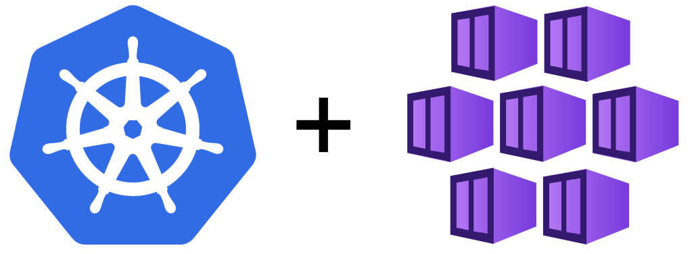

# Introduction Azure Kubernetes Service

<div align=center></div>

Introduction Azure Kubernetes Service


## Create Resource Group

- login at https://portal.azure.com
- create new Resource Group
- Location : Southeast Asia

## Create Service Principle

- login with cli

  ```bash
  az login
  ```

- switch subscription
  
  ```bash
  az account set --subscription xxx
  ```
  
- create SP with SDK Tool
  
  ```bash
  az ad sp create-for-rbac --name sp-xx-xx-xx --skip-assignment --sdk-auth
  ```

## Create Kubernetes Service

- go to Create in Resource group
- in the Create a resource page then select Kubernetes Service
  - Basics
    - Subscrption : 
    - Kubernetes cluster name :  rg-tutorial-cicd-lab
    - Region : Southeast Asia
    - Aviability zones :
  - Node pools
    - Node pools : 
  - Authentication
    - Authenication method : Service principal
    - Service principal client ID : xxx
    - Service principal client secret : xxx
  - Networking
    - DNS name prefix
  - Integration
    - HTTP application routing : Yes
      - Container monitoring : Disable
- Review & Create


## Connect to Kubernetes Service

- Go to resource => aks-lab-001
- Connect Button in Overview
- Open Cloud Shell or the Azure CLI
  
  ```bash
  az account set --subscription xxx
  ```

  ```bash
  az aks get-credentials --resource-group rg-aks-lab --name aks-lab-001
  ```

- Sample commands
  
  ```bash
  #List all deployments in all namespaces
  kubectl get deployments --all-namespaces=true

  # List all deployments in a specific namespace
  # Format :kubectl get deployments --namespace <namespace-name>
  kubectl get deployments --namespace kube-system

  # List details about a specific deployment
  # Format :kubectl describe deployment <deployment-name> --namespace <namespace-name>
  kubectl describe deployment my-dep --namespace kube-system

  # List pods using a specific label
  # Format :kubectl get pods -l <label-key>=<label-value> --all-namespaces=true
  kubectl get pods -l app=nginx --all-namespaces=true

  # Get logs for all pods with a specific label
  # Format :kubecl logs -l <label-key>=<label-value>
  kubectl logs -l app=nginx --namespace kube-system
  ```
- cheat sheet : https://kubernetes.io/docs/reference/kubectl/cheatsheet/


## Kubernetes Concepts

- POD with YAML
- Tips & Tricks - Developing Kubernetes Manifest files with Visual Studio Code
- Replication Controllers and ReplicaSets
- Deployment
- Deployment - Update and Rollback
  
## Networking in Kubernetes

- Basic of Networking in Kubernetes

## Services

- Services - NodePort
- Service - ClusterIP
- Sercice - Load Balancer

